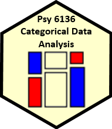

```{r echo = FALSE}
# function to color inline text
colorize <- function(x, color) {
  if (knitr::is_latex_output()) {
    sprintf("\\textcolor{%s}{%s}", color, x)
  } else if (knitr::is_html_output()) {
    sprintf("<span style='color: %s;'>%s</span>", color,
      x)
  } else x
}
```


<center>

</center>

## Course Description 

This course is designed as a broad, applied introduction to the statistical analysis of categorical (or discrete) data, such as counts, proportions, nominal variables, ordinal variables, discrete variables with few values, continuous variables grouped into a small number of categories, etc. 

* The course begins with methods designed for cross-classified table of counts, (i.e., contingency tables), using simple chi square-based methods. 

* It progresses to generalized linear models, for which log-linear models provide a natural extension of simple chi square-based methods. 

* This framework is then extended to comprise logit and logistic regression models for binary responses and generalizations of these models for polytomous (multicategory) outcomes.

Throughout, there is a strong emphasis on associated graphical methods for visualizing categorical data, checking model assumptions, etc. Lab sessions will familiarize the student with software using R for carrying out these analyses.

Course and lecture topics are listed below, in a visual overview. 

* See the [Course schedule](schedule.html) for details of readings, lecture notes, R scripts, etc.
* For students, see [Assignments](about.html#assign) and [Evaluation](about.html(#evaluation)

## Overview & Introduction {#overview}


#### Topics:  `r icon::fa("list", color="darkgreen")`

- Course outline, books, R
- What is categorical data?
- Categorical data analysis: methods & models
- Graphical methods

#### Lecture notes  `r icon::fa("file-pdf", color="red")` 
- [1up PDF](lectures/01-Overview.pdf) || [4up PDF](lectures/01-Overview-2x2.pdf)


## Discrete Distributions


#### Topics:  `r icon::fa("list", color="darkgreen")`

- Discrete distributions: Basic ideas
- Fitting discrete distributions
- Graphical methods: Rootograms, Ord plots
- Robust distribution plots
- Looking ahead

#### Lecture notes  `r icon::fa("file-pdf", color="red")` 
- [1up PDF](lectures/02-Discrete.pdf) || [4up PDF](lectures/02-Discrete-2x2.pdf)

## Two-way Tables


#### Topics:  `r icon::fa("list", color="darkgreen")`

- Overview: $2 \times 2$, $r \times c$, ordered tables
- Independence
- Visualizing association
- Ordinal factors
- Square tables: Observer agreement
- Looking ahead: models

#### Lecture notes  `r icon::fa("file-pdf", color="red")` 
- [1up PDF](lectures/03-Twoway1.pdf) || [4up PDF](lectures/03-Twoway1-2x2.pdf)


## Loglinear models & mosaic displays


#### Topics:  `r icon::fa("list", color="darkgreen")`

- Mosaic displays: Basic ideas
- Loglinear models
- Model-based methods: Fitting & graphing
- Mosaic displays: Visual fitting
- survival on the _Titanic_
- Sequential plots & models

#### Lecture notes  `r icon::fa("file-pdf", color="red")` 
- [1up PDF](lectures/04-Loglin.pdf) || [4up PDF](lectures/04-Loglin-2x2.pdf)

## Correspondence Analysis


#### Topics:  `r icon::fa("list", color="darkgreen")`

- CA: Basic ideas
- Singular value decomposition (SVD)
- Optimal category scores
- Multiway tables: MCA

#### Lecture notes  `r icon::fa("file-pdf", color="red")` 
- [1up PDF](lectures/05-Corresp.pdf) || [4up PDF](lectures/05-Corresp-2x2.pdf)


## Logistic regression


#### Topics:  `r icon::fa("list", color="darkgreen")`

- Model-based methods: Overview
- Logistic regression: one predictor, multiple predictors, fitting
- Visualizing logistic regression
- Effect plots
- Case study: Racial profiling
- Model diagnostics

#### Lecture notes  `r icon::fa("file-pdf", color="red")` 
- [1up PDF](lectures/06-Logistic.pdf) || [4up PDF](lectures/06-Logistic-2x2.pdf)


## Logistic regression: Extensions


#### Topics:  `r icon::fa("list", color="darkgreen")`

- Case study: Survival in the Donner party
- Polytomous response models
  + Proportional odds model
  + Nested dichotomies
  + Multinomial models

#### Lecture notes  `r icon::fa("file-pdf", color="red")` 
- [1up PDF](lectures/07-Logistic2.pdf) || [4up PDF](lectures/07-Logistic2-2x2.pdf)


## Extending loglinear models


#### Topics:  `r icon::fa("list", color="darkgreen")`

- Logit models for response variables
- Models for ordinal factors
- RC models, estimating row/col scores
- Models for square tables
- More complex models

#### Lecture notes  `r icon::fa("file-pdf", color="red")` 
- [1up PDF](lectures/08-Loglin2.pdf) || [4up PDF](lectures/08-Loglin2-2x2.pdf)


## GLMs for count data


#### Topics:  `r icon::fa("list", color="darkgreen")`

- Generalized linear models: Families & links
- GLMs for count data
- Model diagnostics
- Overdispersion
- Excess zeros

#### Lecture notes  `r icon::fa("file-pdf", color="red")` 
- [1up PDF](lectures/09-CountData.pdf) || [4up PDF](lectures/09-CountData-2x2.pdf)


