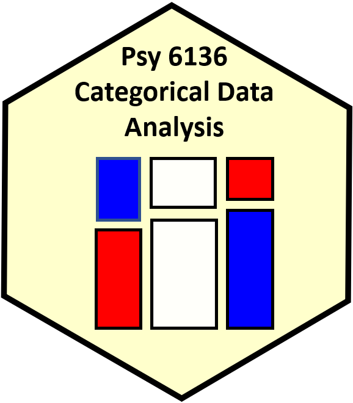
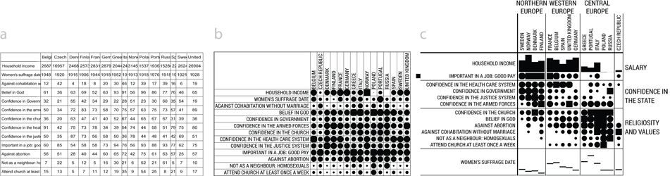
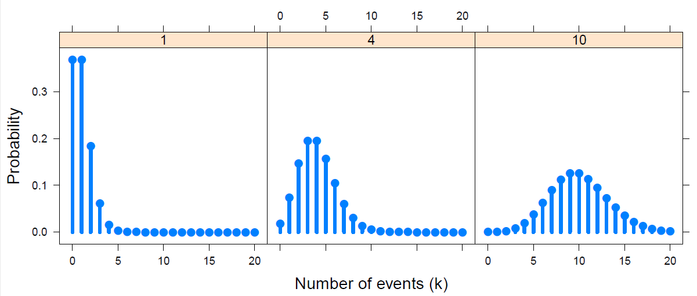
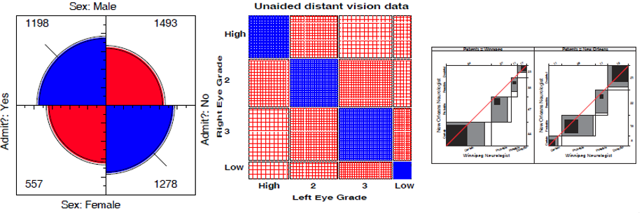
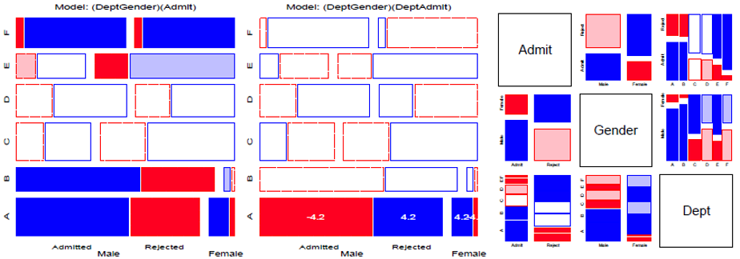
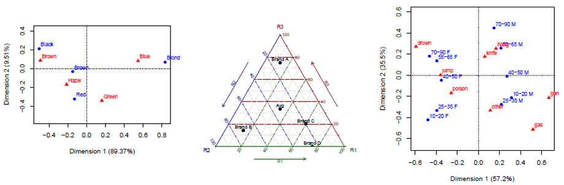
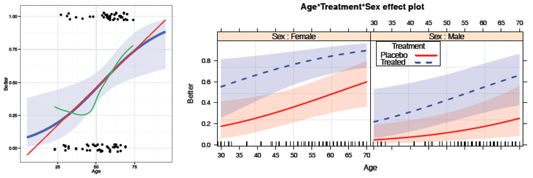
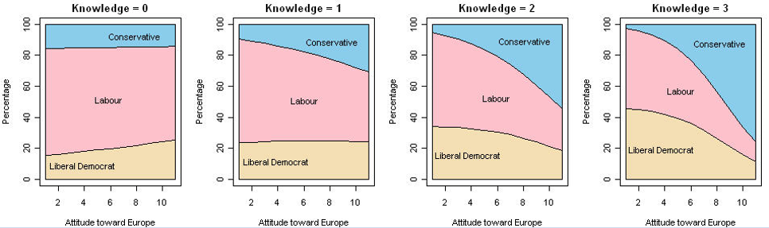
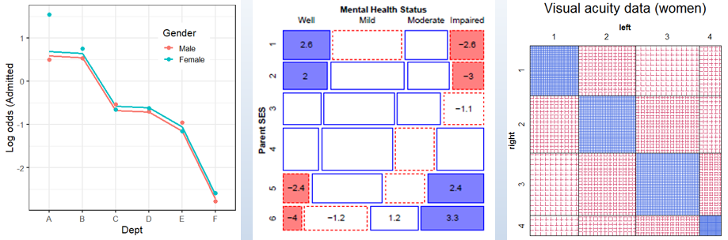
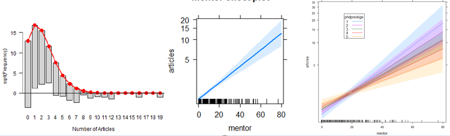

<center>


</center>

```{r setup, echo=FALSE}
source("assets/div_heading.R")
```


## Course Description 

This course is designed as a broad, applied introduction to the statistical analysis of categorical (or discrete) data, such as counts, proportions, nominal variables, ordinal variables, discrete variables with few values, continuous variables grouped into a small number of categories, etc. 

* The course begins with methods designed for cross-classified table of counts, (i.e., contingency tables), using simple chi square-based methods. 

* It progresses to generalized linear models, for which log-linear models provide a natural extension of simple chi square-based methods. 

* This framework is then extended to comprise logit and logistic regression models for binary responses and generalizations of these models for polytomous (multicategory) outcomes.

Throughout, there is a strong emphasis on associated **graphical methods** for visualizing categorical data, checking model assumptions, etc. Lab sessions will familiarize the student with software using R for carrying out these analyses.

Course and lecture topics are listed below, in a visual overview. 

* See the [Course schedule](schedule.html) for details of readings, lecture notes, R scripts, etc.
* For students, see [Assignments](about.html#assign) and [Evaluation](about.html#evaluation)

## Overview & Introduction {#overview}



<!-- #### Topics:  `r icon::fa("list", color="darkgreen")` -->

<!-- <div style="display:flex"> -->
<!--   <i class="fas fa-list" style="color:darkgreen; font-size: 1.25em;"></i> &nbsp; -->
<!--   <h4>Topics</h4> -->
<!-- </div> -->

```{r topics1, results='asis', echo=FALSE}
div_heading("topics")
```


- Course outline, books, R
- What is categorical data?
- Categorical data analysis: methods & models
- Graphical methods

<!-- #### Lecture notes  `r icon::fa("file-pdf", color="red")`  -->
<div style="display:flex">
  <i class="fas fa-file-pdf" style="color:red; font-size: 1.25em;"></i> &nbsp;
  <h4>Lecture notes</h4>
</div>

- [1up PDF](lectures/01-Overview.pdf) || [4up PDF](lectures/01-Overview-2x2.pdf)


<!-- #### Readings: `r icon::fa("book-reader", color="blue")`  -->
<div style="display:flex">
  <i class="fas fa-book-reader" style="color:blue; font-size: 1.25em;"></i> &nbsp;
  <h4>Readings</h4>
</div>

**Bold face** items are considered essential. When there are assignments,
some supplementary readings are mentioned there.

- **DDAR**: [Ch 1](VCDR/chapter01.pdf); [Ch 2](VCDR/chapter02.pdf)
- **Agresti**, Ch 1

<!-- #### Assignment: `r icon::fa("building", color="brown")` -->
```{r asn1, results='asis', echo=FALSE}
div_heading("assign")
```
- [Assignment 1](assign/assign1.pdf)


## Discrete Distributions

Discrete distributions are the gateway drug for categorical data analysis. Meet some 
--- binomial, Poisson, Negative Binomial, and others --- who will
become your friends as you learn to analyze discrete data.

More importantly, learn some nifty graphical methods for fitting these distributions
and understanding why a given one might not fit well. 



<!-- #### Topics: `r icon::fa("list", color="darkgreen")`  -->

```{r topics2, results='asis', echo=FALSE}
div_heading("topics")
```

- Discrete distributions: Basic ideas
- Fitting discrete distributions
- Graphical methods: Rootograms, Ord plots
- Robust distribution plots
- Looking ahead

<!-- #### Lecture notes  `r icon::fa("file-pdf", color="red")`  -->
<div style="display:flex">
  <i class="fas fa-file-pdf" style="color:red; font-size: 1.25em;"></i> &nbsp;
  <h4>Lecture notes</h4>
</div>

- [1up PDF](lectures/02-Discrete.pdf) || [4up PDF](lectures/02-Discrete-2x2.pdf)

<!-- #### Readings: `r icon::fa("book-reader", color="blue")`  -->
<div style="display:flex">
  <i class="fas fa-book-reader" style="color:blue; font-size: 1.25em;"></i> &nbsp;
  <h4>Readings</h4>
</div>

- **DDAR**: [Ch 3](VCDR/chapter03.pdf)

<!-- #### Quiz: `r icon::fa("building", color="brown")`  -->

```{r quiz1, results='asis', echo=FALSE}
div_heading("quiz")
```

- [Quiz 1 - Discrete distributions](assign/quiz1-discrete.html)


## Two-way Tables

How can we test for independence and measure the strength of association in two way tables?
Get acquainted with some standard tests and statistics: Pearson $\chi^2$, Odds ratio,
Cramer's $V$, Cohen's $\kappa$ and even Bangdiwal's $W$.

More importantly, how can we _visualize_ association? We'll meet fourfold plots, sieve diagrams,
spine plots.  Much of this is prep for understanding how to formulate, test and visualize
models for categorical data.



<!-- #### Topics:  `r icon::fa("list", color="darkgreen")` -->

```{r topics3, results='asis', echo=FALSE}
div_heading("topics")
```

- Overview: $2 \times 2$, $r \times c$, ordered tables
- Independence
- Visualizing association
- Ordinal factors
- Square tables: Observer agreement
- Looking ahead: models


<!-- #### Lecture notes  `r icon::fa("file-pdf", color="red")`  -->
<div style="display:flex">
  <i class="fas fa-file-pdf" style="color:red; font-size: 1.25em;"></i> &nbsp;
  <h4>Lecture notes</h4>
</div>

- [1up PDF](lectures/03-Twoway1.pdf) || [4up PDF](lectures/03-Twoway1-2x2.pdf)
- [Tutorial on two way tables](tutorials/twoway.pdf)

<!-- #### Readings: `r icon::fa("book-reader", color="blue")`  -->
<div style="display:flex">
  <i class="fas fa-book-reader" style="color:blue; font-size: 1.25em;"></i> &nbsp;
  <h4>Readings</h4>
</div>

- **DDAR**: [Ch 4](VCDR/chapter04.pdf)
- **Agresti, Ch 2**

<!-- #### Quiz: `r icon::fa("building", color="brown")`  -->

```{r quiz2, results='asis', echo=FALSE}
div_heading("quiz")
```

- [Quiz 2 - Two-way tables](assign/quiz2-twoway.html)

## Loglinear models & mosaic displays

```
  Some people think nothing is prettier
  Than algebra of models log-linear.
    But I've got the hots
    For my mosaic plots
  With all those squares in the interior.
```
  --- by Michael Greenacre (see his Statistical Songs, https://www.youtube.com/StatisticalSongs)




<!-- #### Topics:  `r icon::fa("list", color="darkgreen")` -->

```{r topics4, results='asis', echo=FALSE}
div_heading("topics")
```

- Mosaic displays: Basic ideas
- Loglinear models
- Model-based methods: Fitting & graphing
- Mosaic displays: Visual fitting
- survival on the _Titanic_
- Sequential plots & models

<!-- #### Lecture notes  `r icon::fa("file-pdf", color="red")`  -->
<div style="display:flex">
  <i class="fas fa-file-pdf" style="color:red; font-size: 1.25em;"></i> &nbsp;
  <h4>Lecture notes</h4>
</div>

- [1up PDF](lectures/04-Loglin.pdf) || [4up PDF](lectures/04-Loglin-2x2.pdf)

```{r quiz3, results='asis', echo=FALSE}
div_heading("quiz")
```

- [Quiz 3 - Loglinear models](assign/quiz3-loglin.html)


## Correspondence Analysis

Correspondence analysis (CA) is one of the first things I think of when I meet a new frequency table and
want to get a quick look at the relations among the row and column categories.
Very much like PCA for quantitative data, think of CA as a **multivariate juicer** that takes a 
high-dimensional data set and squeezes it into a 2D (or 3D) space that best accounts for the
associations (Pearson $\chi^2$) between the row and column categories.
The category scores on the dimensions are in fact the best numerical values that can be defined.
They can be used to permute the categories in mosaic displays to make the pattern of associations
as clear as possible.



<!-- #### Topics:  `r icon::fa("list", color="darkgreen")` -->

```{r topics5, results='asis', echo=FALSE}
div_heading("topics")
```

- CA: Basic ideas
- Singular value decomposition (SVD)
- Optimal category scores
- Multiway tables: MCA

<!-- #### Lecture notes  `r icon::fa("file-pdf", color="red")`  -->
<div style="display:flex">
  <i class="fas fa-file-pdf" style="color:red; font-size: 1.25em;"></i> &nbsp;
  <h4>Lecture notes</h4>
</div>

- [1up PDF](lectures/05-Corresp.pdf) || [4up PDF](lectures/05-Corresp-2x2.pdf)


## Logistic regression

Logistic regression provides an entry to model-based methods for categorical data
analysis. These provide estimates and tests for predictor variables of a
binary outcome, but more importantly, allow graphs of a fitted outcome together
with confidence bands representing uncertainty,



<!-- #### Topics:  `r icon::fa("list", color="darkgreen")` -->

```{r topics6, results='asis', echo=FALSE}
div_heading("topics")
```

- Model-based methods: Overview
- Logistic regression: one predictor, multiple predictors, fitting
- Visualizing logistic regression
- Effect plots
- Case study: Racial profiling
- Model diagnostics

<!-- #### Lecture notes  `r icon::fa("file-pdf", color="red")`  -->
<div style="display:flex">
  <i class="fas fa-file-pdf" style="color:red; font-size: 1.25em;"></i> &nbsp;
  <h4>Lecture notes</h4>
</div>

- [1up PDF](lectures/06-Logistic.pdf) || [4up PDF](lectures/06-Logistic-2x2.pdf)


## Logistic regression: Extensions

The ideas behind logistic regression can be extended in a variety of ways.
The effects of predictors on a binary response can incorporate non-linear terms
and interactions. When the outcome is **polytomous** (more than two categories),
and the response categories are ordered,
the _proportional odds model_ provides a simple framework.
Other methods for polytomous outcomes include _nested dichotomies_ and
the general _multinomial_ logistic regression model.




<!-- #### Topics:  `r icon::fa("list", color="darkgreen")` -->
```{r topics7, results='asis', echo=FALSE}
div_heading("topics")
```

- Case study: Survival in the Donner party
- Polytomous response models
  + Proportional odds model
  + Nested dichotomies
  + Multinomial models

<!-- #### Lecture notes  `r icon::fa("file-pdf", color="red")`  -->
<div style="display:flex">
  <i class="fas fa-file-pdf" style="color:red; font-size: 1.25em;"></i> &nbsp;
  <h4>Lecture notes</h4>
</div>

- [1up PDF](lectures/07-Logistic2.pdf) || [4up PDF](lectures/07-Logistic2-2x2.pdf)


## Extending loglinear models

Here we return to loglinear models to consider extensions to the `glm()` framework.
Models for ordinal factors have greater power when associations reflect their ordered nature.
The `gnm` package extends these to generalized _non-linear_ models.
For **square tables**, we can fit a variety of specialized models, including
_quasi-independence_, _symmetry_ and _quasi-symmetry_.



<!-- #### Topics:  `r icon::fa("list", color="darkgreen")` -->
```{r topics8, results='asis', echo=FALSE}
div_heading("topics")
```

- Logit models for response variables
- Models for ordinal factors
- RC models, estimating row/col scores
- Models for square tables
- More complex models

<!-- #### Lecture notes  `r icon::fa("file-pdf", color="red")`  -->
<div style="display:flex">
  <i class="fas fa-file-pdf" style="color:red; font-size: 1.25em;"></i> &nbsp;
  <h4>Lecture notes</h4>
</div>

- [1up PDF](lectures/08-Loglin2.pdf) || [4up PDF](lectures/08-Loglin2-2x2.pdf)


## GLMs for count data

Here we consider generalized linear models more broadly, with emphasis on those for 
a count or frequency response variable in the Poisson family.
Some extensions allow for **overdispersion**, including the _quasi-poisson_
and _negative binomial_ model.  When the data exhibits a greater frequency of
0 counts, **zero-infalted** versions of these models come to the rescue.




<!-- #### Topics:  `r icon::fa("list", color="darkgreen")` -->
```{r topics9, results='asis', echo=FALSE}
div_heading("topics")
```

- Generalized linear models: Families & links
- GLMs for count data
- Model diagnostics
- Overdispersion
- Excess zeros

<!-- #### Lecture notes  `r icon::fa("file-pdf", color="red")`  -->
<div style="display:flex">
  <i class="fas fa-file-pdf" style="color:red; font-size: 1.25em;"></i> &nbsp;
  <h4>Lecture notes</h4>
</div>

- [1up PDF](lectures/09-CountData.pdf) || [4up PDF](lectures/09-CountData-2x2.pdf)


