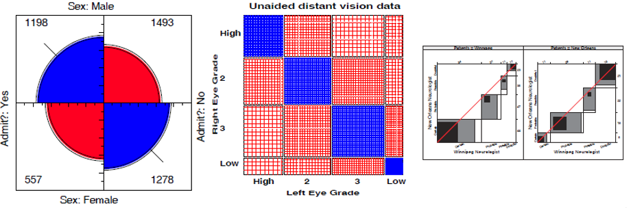
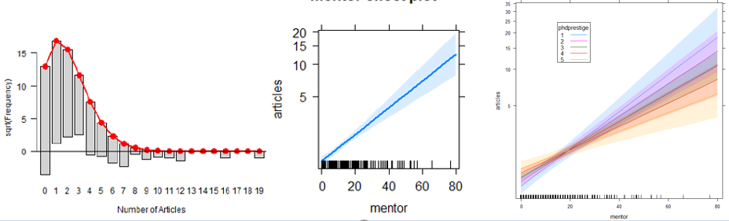

```{r echo = FALSE}
# function to color inline text
colorize <- function(x, color) {
  if (knitr::is_latex_output()) {
    sprintf("\\textcolor{%s}{%s}", color, x)
  } else if (knitr::is_html_output()) {
    sprintf("<span style='color: %s;'>%s</span>", color,
      x)
  } else x
}
```


<center>

</center>

## Course Description 

This course is designed as a broad, applied introduction to the statistical analysis of categorical (or discrete) data, such as counts, proportions, nominal variables, ordinal variables, discrete variables with few values, continuous variables grouped into a small number of categories, etc. 

* The course begins with methods designed for cross-classified table of counts, (i.e., contingency tables), using simple chi square-based methods. 

* It progresses to generalized linear models, for which log-linear models provide a natural extension of simple chi square-based methods. 

* This framework is then extended to comprise logit and logistic regression models for binary responses and generalizations of these models for polytomous (multicategory) outcomes.

Throughout, there is a strong emphasis on associated graphical methods for visualizing categorical data, checking model assumptions, etc. Lab sessions will familiarize the student with software using R for carrying out these analyses.

Course topics are listed below. See the [Course schedule](schedule.html) for details.

## Overview & Introduction {#overview}


## Discrete Distributions


## Two-way Tables



## Loglinear models & mosaic displays


## Correspondence Analysis


## Logistic regression


## Logistic regression: Extensions


## Extending loglinear models


## GLMs for count data



