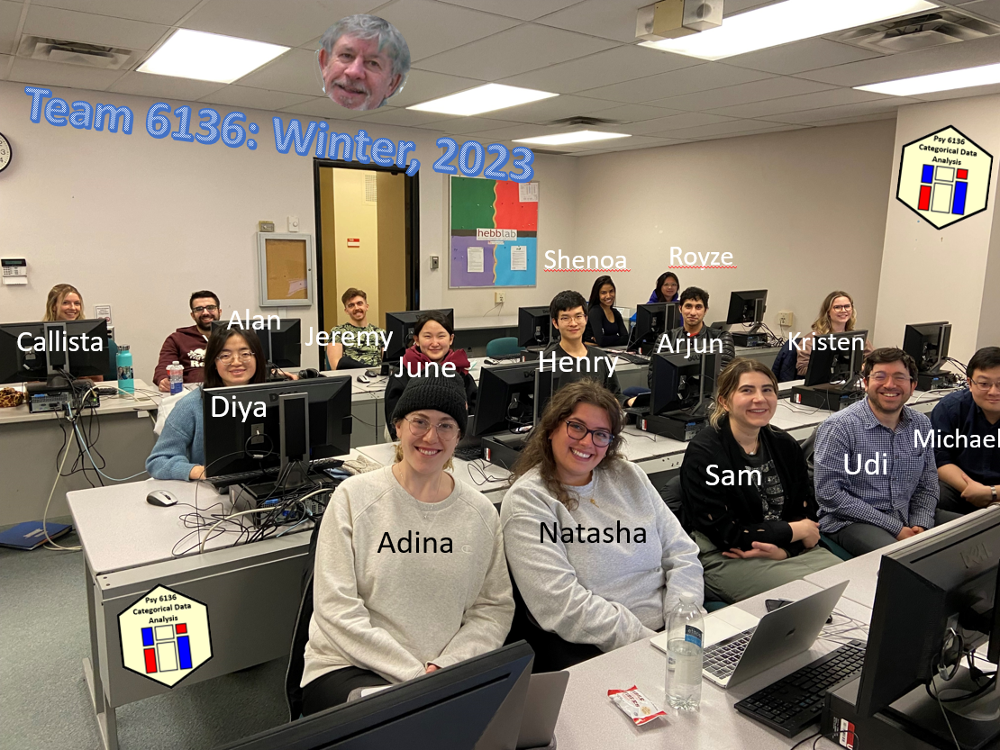
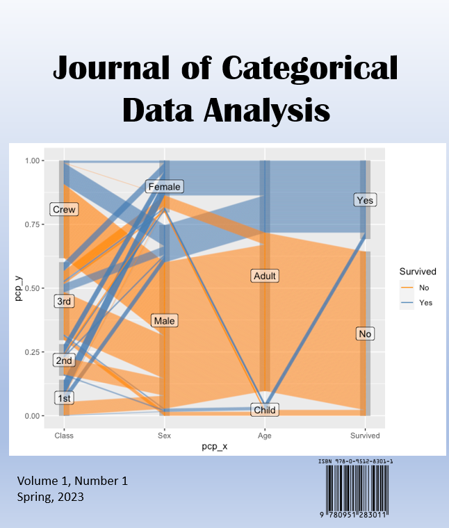

## Team 6136
Student in Psych 6136, Winter, 2023

<!--  -->

## Final Projects

<!--  -->

The following projects were submitted in the course.  All were of sufficient quality to
be forwarded to the nacent _Journal of Categorical Data Analysis_.

* Feldman, Samantha and  Levi, Adina, and Baptist-Mohseni, Natasha. _A Broad Review of Categorical Data Analysis in Clinical and Neuropsychology_.
* Forsythe, Jeremy and Forchuk, Callista, and Kian Alan . _Nascent Areas for Categorical Data Analysis: Describing and Applying Latent Class Analysis (LCA) with a focus on Clinical Psychology Research_.
* Lee, Hyeonchung & Kim, Jueun. _Predicting the Stay of Removal Decisions_.
* Lott, Kristen. _Latent Class Analysis for the Social and Behavioural Sciences_.
* Simon, Jenny Royze. _Recent Developments in Categorical Data Analysis_.
* Singh, Arjunvir. _Tidy CDA_.
* Truong, Michael and Alter, Udi. _Throwing a fit: A novel method to properly evaluate goodness-of-fit between discrete distributions_.
* Yang, Dia. _Analysis of Canadian Refugee Board Stay of Removal Decisions_.

