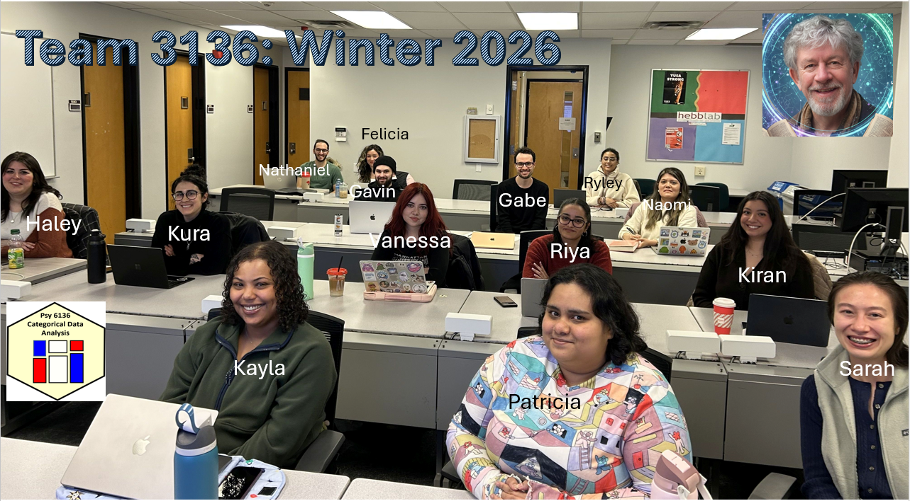
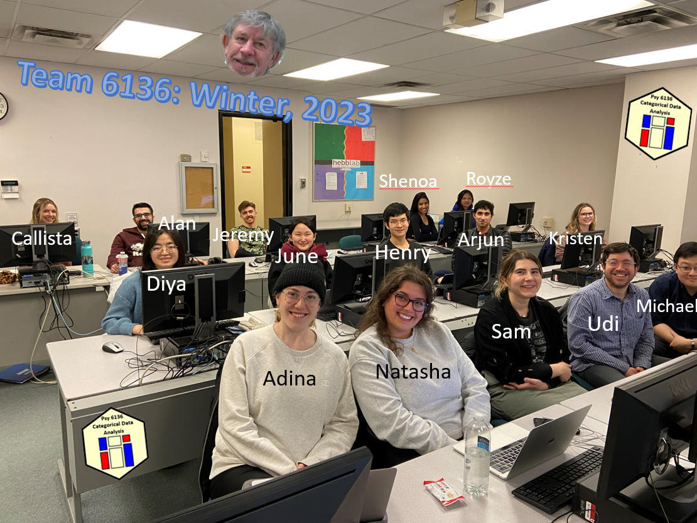
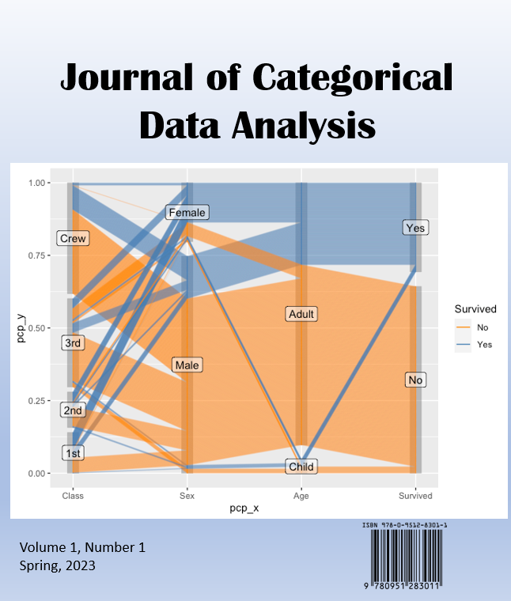

This page exists only to recognize the contributions of past students in this course and to serve as examples and guidance for current students. It is also a tribute to their work and enthusiasm!

Any materials linked on this page are the intellectual property of the students in this course.  They may not be
reproduced or used in any other manner without express permission of the student involved.
Don't even think about it.

## 2026 {#2026}

### Team 6136
Students in Psych 6136, Winter, 2026

### Final Projects

WIP! Some of the abstracts submitted are in [Psy6136 Final Project Abstracts](students/Psy6136 Final Project Abstracts.docx)

* Kyra Farrelly, _Latent Class Analysis Tutorial: Understanding Cannabis and Other Drug Usage Patterns_
* Gavin Klorfine, _Steps Toward Tidy Categorical Data Analysis in R_
* Felicia Tassone & Nathaniel Goldstein, _Using Categorical Data Methods to Quantify Reaching and Grasping Kinematics_ [Video presentation](https://drive.google.com/file/d/1-QuXonkUZdS_vbCebbFfN4SO490bkcyz/view?usp=sharing)
* Riya Trikha, _Exploring Free Association_
* Haley Bernusky, _LCA for categorical substance use data_
* Gabriel Crone & Naomi Martinez Gutierrez, _Shiny Mosaics app_

## 2023 {#2023}

### Team 6136
Students in Psych 6136, Winter, 2023

<!--  -->

### Final Projects

<!--  -->

The following projects were submitted in the course.  All were of sufficient quality to
be forwarded to the nacent _Journal of Categorical Data Analysis_.

* Feldman, Samantha and  Levi, Adina, and Baptist-Mohseni, Natasha. _A Broad Review of Categorical Data Analysis in Clinical and Neuropsychology_.
* Forsythe, Jeremy and Forchuk, Callista, and Kian Alan . _Nascent Areas for Categorical Data Analysis: Describing and Applying Latent Class Analysis (LCA) with a focus on Clinical Psychology Research_.
* Lee, Hyeonchung & Kim, Jueun. _Predicting the Stay of Removal Decisions_.
* Lott, Kristen. _Latent Class Analysis for the Social and Behavioural Sciences_.
* Simon, Jenny Royze. _Recent Developments in Categorical Data Analysis_.
* Singh, Arjunvir. _Tidy CDA_.
* Truong, Michael and Alter, Udi. _Throwing a fit: A novel method to properly evaluate goodness-of-fit between discrete distributions_.
* Yang, Dia. _Analysis of Canadian Refugee Board Stay of Removal Decisions_.

